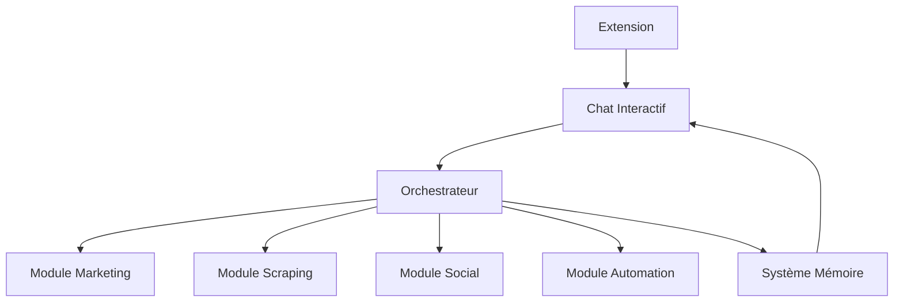

# Flux de Données de l'Application Setharkk

## 1. Flux Principal

## 2. Cycle de Vie des Données

### Entrée Utilisateur
1. Chat reçoit la commande
2. Analyse du contexte
3. Consultation mémoire
4. Routage vers module

### Traitement Module
1. Validation commande
2. Exécution
3. Retour résultat
4. Mise à jour mémoire

### Apprentissage
1. Analyse pattern
2. Mise à jour contexte
3. Optimisation réponses
4. Stockage connaissance

## 3. Règles de Flux

### Chat → Modules
- Commandes validées
- Contexte inclus
- Priorité définie

### Modules → Mémoire
- Résultats analysés
- Patterns extraits
- Performance mesurée

### Extension → Chat
- Données nettoyées
- Source vérifiée
- Format standardisé

## 4. Optimisation

### Cache
- Résultats fréquents
- Contextes récents
- Patterns communs

### Performance
- Requêtes groupées
- Traitement asynchrone
- Priorité dynamique

## 5. Sécurité

### Validation
- Entrées utilisateur
- Données modules
- Résultats extension

### Chiffrement
- Communications
- Stockage sensible
- Tokens

## 6. Monitoring

### Métriques
- Temps traitement
- Taux succès
- Utilisation mémoire

### Alertes
- Erreurs critiques
- Performances faibles
- Sécurité compromise 