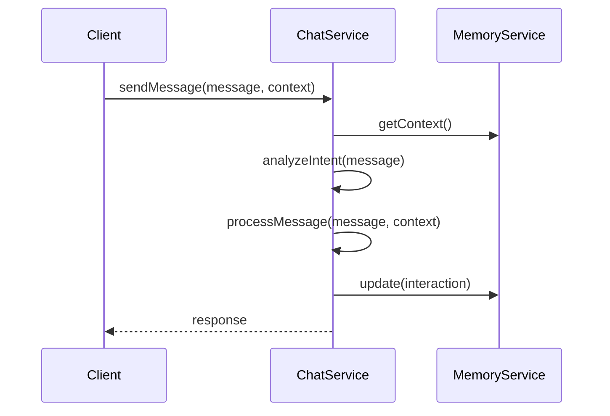
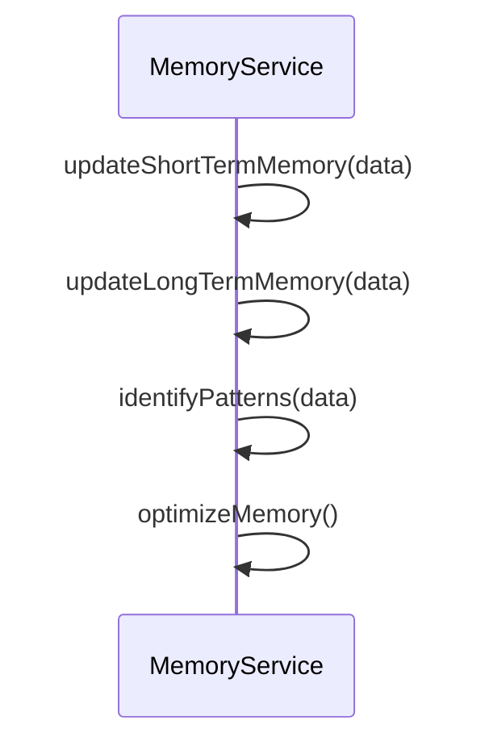
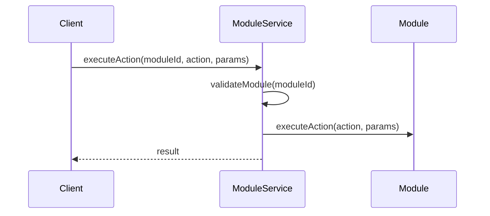

# Documentation Technique - Assistant Setharkk

## Architecture

### Vue d'ensemble
L'application est construite sur une architecture modulaire basée sur des services interconnectés :

```
app/
├── backend/
│   ├── src/
│   │   ├── services/        # Services principaux
│   │   ├── routes/          # Routes API
│   │   ├── models/          # Modèles de données
│   │   └── index.ts         # Point d'entrée
│   └── tests/              # Tests unitaires et d'intégration
└── frontend/              # Interface utilisateur (à venir)
```

### Services Principaux

#### 1. ChatService
```typescript
class ChatService extends EventEmitter {
    // Gestion du contexte de chat
    private context: ChatContext;
    
    // Méthodes principales
    async sendMessage(message: string, context?: Record<string, any>);
    async getContext(): Promise<any>;
    
    // Méthodes privées
    private async enrichContext(context: Record<string, any>);
    private async processMessage(message: string, context: Record<string, any>);
    private async analyzeIntent(message: string);
    private extractEntities(message: string);
}
```

#### 2. MemoryService
```typescript
class MemoryService extends EventEmitter {
    // Gestion de la mémoire
    private memory: MemoryState;
    
    // Méthodes principales
    async update(data: any): Promise<boolean>;
    async getContext(): Promise<Record<string, any>>;
    async getState(): Promise<Record<string, any>>;
    
    // Méthodes privées
    private updateShortTermMemory(data: any);
    private async updateLongTermMemory(data: any);
    private updateContext(data: any);
    private identifyPatterns(data: any);
}
```

#### 3. ModuleService
```typescript
class ModuleService extends EventEmitter {
    // Gestion des modules
    private modules: Map<string, Module>;
    private activeModules: Set<string>;
    
    // Méthodes principales
    async executeAction(moduleId: string, action: string, params?: Record<string, any>);
    async loadModule(moduleId: string, config?: Record<string, any>);
    async unloadModule(moduleId: string);
    
    // Méthodes privées
    private async initializeModules();
    private async activateModule(moduleId: string);
    private async deactivateModule(moduleId: string);
}
```

#### 4. SystemService
```typescript
class SystemService extends EventEmitter {
    // Commandes système autorisées
    private allowedCommands: Set<string>;
    
    // Méthodes principales
    async executeCommand(command: string, params?: Record<string, any>);
    
    // Méthodes privées
    private async getSystemStatus();
    private async diagnoseProblem(params: Record<string, any>);
    private async optimizeSystem(params: Record<string, any>);
}
```

## Flux de Données

### 1. Traitement des Messages


### 2. Gestion de la Mémoire


### 3. Exécution des Modules


## Gestion des Événements

### Événements Système
```typescript
// Événements émis par SystemService
'system:event' => { type: 'error' | 'warning' | 'info', message: string, data?: any }
'system:status' => { status: SystemStatus }
'system:error' => { error: Error }

// Événements émis par ModuleService
'module:loaded' => { moduleId: string, config: any }
'module:unloaded' => { moduleId: string }
'module:action' => { moduleId: string, action: string, result: any }

// Événements émis par MemoryService
'memory:updated' => { type: 'update', data: any }
'memory:optimized' => { type: 'optimize', stats: any }

// Événements émis par ChatService
'message' => { message: string, response: any, context: any }
'intent' => { type: string, confidence: number, entities: any[] }
```

## Sécurité

### 1. Validation des Entrées
- Validation des paramètres avec TypeScript
- Sanitization des entrées utilisateur
- Validation des commandes système

### 2. Gestion des Erreurs
```typescript
try {
    // Code potentiellement dangereux
} catch (err) {
    logger.error('Description détaillée:', err);
    throw new CustomError('Message utilisateur approprié');
}
```

### 3. Logging Sécurisé
```typescript
// Configuration du logger
const logger = winston.createLogger({
    level: process.env.LOG_LEVEL || 'info',
    format: winston.format.combine(
        winston.format.timestamp(),
        winston.format.json()
    ),
    transports: [
        new winston.transports.File({ filename: 'error.log', level: 'error' }),
        new winston.transports.File({ filename: 'combined.log' })
    ]
});
```

## Tests

### 1. Tests Unitaires
```typescript
describe('ChatService', () => {
    it('should analyze message intent', async () => {
        const service = new ChatService();
        const intent = await service.analyzeIntent('Hello');
        expect(intent.type).toBe('greeting');
    });
});
```

### 2. Tests d'Intégration
```typescript
describe('Module Integration', () => {
    it('should execute module action', async () => {
        const moduleService = new ModuleService();
        const result = await moduleService.executeAction('test', 'action');
        expect(result.success).toBe(true);
    });
});
```

## Performance

### 1. Optimisation de la Mémoire
- Nettoyage automatique de la mémoire court terme
- Optimisation périodique de la mémoire long terme
- Gestion efficace du cache

### 2. Gestion des Ressources
- Limitation du nombre de connexions
- Compression des réponses
- Mise en cache des résultats fréquents

## Déploiement

### 1. Variables d'Environnement
```env
NODE_ENV=production
PORT=3000
MONGODB_URI=mongodb://localhost:27017/setharkk
REDIS_URL=redis://localhost:6379
LOG_LEVEL=info
```

### 2. Scripts de Déploiement
```bash
# Build
npm run build

# Start
npm start

# Monitor
pm2 start dist/index.js
```

## Maintenance

### 1. Logs
- Rotation quotidienne des logs
- Niveaux de log configurables
- Format JSON pour analyse

### 2. Backups
- Sauvegarde automatique de la mémoire
- Export/Import des configurations
- Restauration des points de sauvegarde

### 3. Monitoring
- Surveillance des performances
- Alertes système
- Métriques d'utilisation 